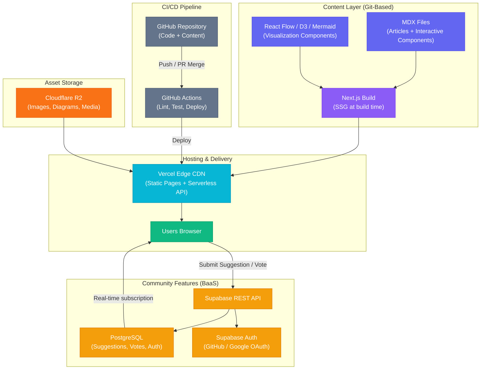
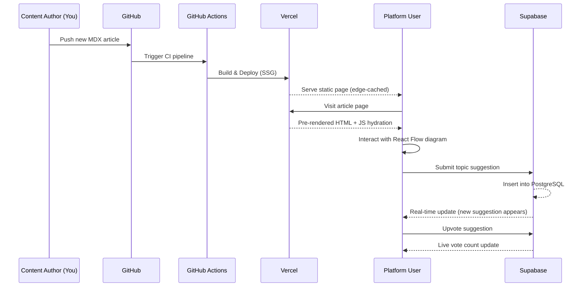
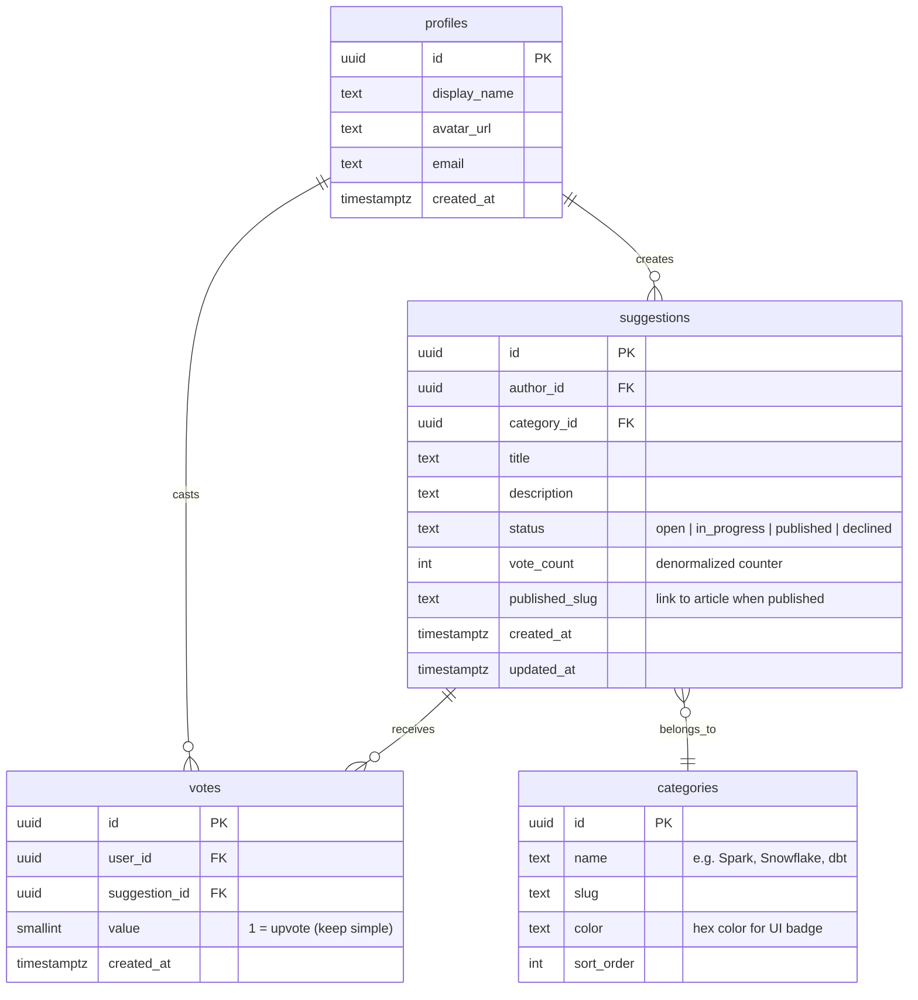

# DataViz Academy — Architecture Blueprint & Execution Plan

A visual-first learning platform for Data Science and Data Engineering, built on free-tier infrastructure with interactive diagrams, architecture visualizations, and community-driven content suggestions.

---

## 1. Architecture Blueprint

### Tech Stack Summary

| Layer | Technology | Why This Choice | Free Tier Limits |
|---|---|---|---|
| **Frontend Framework** | **Next.js 15 (App Router)** | SSG for content pages (instant loads), React ecosystem for viz libs, MDX-native support | — |
| **Content Authoring** | **MDX (Markdown + JSX)** | Write articles in Markdown, embed interactive React components inline — no CMS, no database for content | — |
| **Visualization** | **React Flow** + **D3.js** + **Mermaid** + **Shiki** | React Flow for pipeline/DAG diagrams, D3 for custom charts, Mermaid for quick diagrams in MDX, Shiki for code highlighting | — |
| **Backend / BaaS** | **Supabase** | Postgres DB, Auth, real-time subscriptions, REST API — all free tier | 500 MB DB, 1 GB storage, 50K MAU |
| **Hosting** | **Vercel** | Zero-config Next.js deployment, edge CDN, preview deploys on PRs | 100 GB bandwidth, serverless functions |
| **Analytics** | **Vercel Analytics** or **Plausible (self-host)** | Privacy-friendly, lightweight | Free on Vercel hobby |
| **Version Control** | **GitHub** | Content + code in one monorepo, PR-based content review | Free for public repos |
| **CI/CD** | **GitHub Actions** | Auto-deploy on merge, MDX linting, link checking | 2,000 min/month free |
| **Media/Assets** | **Cloudflare R2** or **Vercel Blob** | Store images, GIFs, and video assets | R2: 10 GB free storage |

---

### Why This Stack Fits Your Profile

> [!TIP]
> As a Data Engineer, you already think in DAGs, pipelines, and schemas. This stack maps directly to your mental model:
> - **MDX files** = your "source data" (content as code)
> - **Next.js build** = your "transformation layer" (MDX → HTML)
> - **Vercel CDN** = your "serving layer" (edge-cached static pages)
> - **Supabase** = your "operational database" (community features)

---

### Visualization Library Decision Matrix

| Library | Best For | Learning Curve | Interactive? | Use Case on Your Platform |
|---|---|---|---|---|
| **React Flow** | Node/edge diagrams, DAGs, flowcharts | Low | ✅ Drag, zoom, pan | Spark execution plans, pipeline architectures, data lineage |
| **D3.js** | Custom statistical charts, force-directed graphs | High | ✅ Full control | Distribution plots, performance benchmarks, custom viz |
| **Mermaid** | Quick inline diagrams in MDX | Very Low | ❌ Static (but rendered at build) | ER diagrams, sequence diagrams, simple flows |
| **Shiki** + **rehype-pretty-code** | Code blocks with syntax highlighting | Very Low | ❌ Static | PySpark snippets, SQL examples, YAML configs |
| **Sandpack** (CodeSandbox) | Live, editable code playgrounds | Low | ✅ Runnable code | Let users tweak Python/SQL snippets and see results |

> [!IMPORTANT]
> **Recommended starting set:** React Flow + Mermaid + Shiki. Add D3.js and Sandpack in Phase 2 once the core platform is live. This avoids over-engineering the MVP.

---

## 2. Architecture Diagram



### Data Flow Summary



---

## 3. Data Model — Suggestion & Voting System

### Entity-Relationship Diagram



### SQL Schema (Supabase / PostgreSQL)

```sql
-- ============================================
-- PROFILES (extends Supabase auth.users)
-- ============================================
CREATE TABLE public.profiles (
    id          UUID PRIMARY KEY REFERENCES auth.users(id) ON DELETE CASCADE,
    display_name TEXT NOT NULL DEFAULT '',
    avatar_url  TEXT,
    email       TEXT,
    created_at  TIMESTAMPTZ NOT NULL DEFAULT now()
);

-- Auto-create profile on signup
CREATE OR REPLACE FUNCTION public.handle_new_user()
RETURNS TRIGGER AS $$
BEGIN
    INSERT INTO public.profiles (id, display_name, avatar_url, email)
    VALUES (
        NEW.id,
        COALESCE(NEW.raw_user_meta_data->>'full_name', NEW.raw_user_meta_data->>'name', ''),
        COALESCE(NEW.raw_user_meta_data->>'avatar_url', ''),
        NEW.email
    );
    RETURN NEW;
END;
$$ LANGUAGE plpgsql SECURITY DEFINER;

CREATE TRIGGER on_auth_user_created
    AFTER INSERT ON auth.users
    FOR EACH ROW EXECUTE FUNCTION public.handle_new_user();

-- ============================================
-- CATEGORIES
-- ============================================
CREATE TABLE public.categories (
    id          UUID PRIMARY KEY DEFAULT gen_random_uuid(),
    name        TEXT NOT NULL UNIQUE,
    slug        TEXT NOT NULL UNIQUE,
    color       TEXT NOT NULL DEFAULT '#6366f1',
    sort_order  INT NOT NULL DEFAULT 0
);

INSERT INTO public.categories (name, slug, color, sort_order) VALUES
    ('Apache Spark',     'spark',      '#E25A1C', 1),
    ('Snowflake',        'snowflake',  '#29B5E8', 2),
    ('dbt',              'dbt',        '#FF694A', 3),
    ('Python / Pandas',  'python',     '#3776AB', 4),
    ('Data Modeling',    'modeling',    '#10B981', 5),
    ('Pipeline Design',  'pipelines',  '#8B5CF6', 6),
    ('SQL',              'sql',        '#F59E0B', 7),
    ('MLOps',            'mlops',      '#EC4899', 8);

-- ============================================
-- SUGGESTIONS
-- ============================================
CREATE TABLE public.suggestions (
    id              UUID PRIMARY KEY DEFAULT gen_random_uuid(),
    author_id       UUID NOT NULL REFERENCES public.profiles(id) ON DELETE CASCADE,
    category_id     UUID NOT NULL REFERENCES public.categories(id),
    title           TEXT NOT NULL CHECK (char_length(title) BETWEEN 10 AND 200),
    description     TEXT NOT NULL CHECK (char_length(description) BETWEEN 20 AND 2000),
    status          TEXT NOT NULL DEFAULT 'open'
                        CHECK (status IN ('open', 'in_progress', 'published', 'declined')),
    vote_count      INT NOT NULL DEFAULT 0,
    published_slug  TEXT,
    created_at      TIMESTAMPTZ NOT NULL DEFAULT now(),
    updated_at      TIMESTAMPTZ NOT NULL DEFAULT now()
);

CREATE INDEX idx_suggestions_status ON public.suggestions(status);
CREATE INDEX idx_suggestions_votes  ON public.suggestions(vote_count DESC);
CREATE INDEX idx_suggestions_author ON public.suggestions(author_id);

-- ============================================
-- VOTES (one vote per user per suggestion)
-- ============================================
CREATE TABLE public.votes (
    id              UUID PRIMARY KEY DEFAULT gen_random_uuid(),
    user_id         UUID NOT NULL REFERENCES public.profiles(id) ON DELETE CASCADE,
    suggestion_id   UUID NOT NULL REFERENCES public.suggestions(id) ON DELETE CASCADE,
    value           SMALLINT NOT NULL DEFAULT 1 CHECK (value = 1),
    created_at      TIMESTAMPTZ NOT NULL DEFAULT now(),
    UNIQUE(user_id, suggestion_id)
);

-- ============================================
-- VOTE COUNT TRIGGERS (keep denormalized count in sync)
-- ============================================
CREATE OR REPLACE FUNCTION public.update_vote_count()
RETURNS TRIGGER AS $$
BEGIN
    IF TG_OP = 'INSERT' THEN
        UPDATE public.suggestions
            SET vote_count = vote_count + NEW.value,
                updated_at = now()
            WHERE id = NEW.suggestion_id;
    ELSIF TG_OP = 'DELETE' THEN
        UPDATE public.suggestions
            SET vote_count = vote_count - OLD.value,
                updated_at = now()
            WHERE id = OLD.suggestion_id;
    END IF;
    RETURN NULL;
END;
$$ LANGUAGE plpgsql SECURITY DEFINER;

CREATE TRIGGER on_vote_change
    AFTER INSERT OR DELETE ON public.votes
    FOR EACH ROW EXECUTE FUNCTION public.update_vote_count();

-- ============================================
-- ROW LEVEL SECURITY (RLS)
-- ============================================
ALTER TABLE public.profiles    ENABLE ROW LEVEL SECURITY;
ALTER TABLE public.suggestions ENABLE ROW LEVEL SECURITY;
ALTER TABLE public.votes       ENABLE ROW LEVEL SECURITY;
ALTER TABLE public.categories  ENABLE ROW LEVEL SECURITY;

-- Profiles: anyone can read, only owner can update
CREATE POLICY "Profiles are viewable by everyone"
    ON public.profiles FOR SELECT USING (true);
CREATE POLICY "Users can update own profile"
    ON public.profiles FOR UPDATE USING (auth.uid() = id);

-- Categories: public read-only
CREATE POLICY "Categories are viewable by everyone"
    ON public.categories FOR SELECT USING (true);

-- Suggestions: anyone can read, authenticated users can create
CREATE POLICY "Suggestions are viewable by everyone"
    ON public.suggestions FOR SELECT USING (true);
CREATE POLICY "Authenticated users can create suggestions"
    ON public.suggestions FOR INSERT WITH CHECK (auth.uid() = author_id);
CREATE POLICY "Authors can update own suggestions"
    ON public.suggestions FOR UPDATE USING (auth.uid() = author_id);

-- Votes: anyone can read, authenticated users can create/delete own
CREATE POLICY "Votes are viewable by everyone"
    ON public.votes FOR SELECT USING (true);
CREATE POLICY "Authenticated users can vote"
    ON public.votes FOR INSERT WITH CHECK (auth.uid() = user_id);
CREATE POLICY "Users can remove own vote"
    ON public.votes FOR DELETE USING (auth.uid() = user_id);
```

---

## 4. Content Authoring Workflow

### How You'll Write Articles (MDX Example)

```mdx
---
title: "How Spark Handles Lazy Evaluation"
description: "A visual guide to understanding Spark's execution model"
category: spark
publishedAt: "2026-05-15"
author: "Your Name"
tags: ["spark", "lazy-evaluation", "DAG"]
---

import { SparkDAGDiagram } from '@/components/viz/SparkDAGDiagram'
import { CodeBlock } from '@/components/ui/CodeBlock'

# How Spark Handles Lazy Evaluation

When you chain transformations in PySpark, Spark doesn't execute them immediately.
Instead, it builds a **Directed Acyclic Graph (DAG)** of operations.

## The Execution Flow

<SparkDAGDiagram
  nodes={[
    { id: 'read', label: 'Read CSV', type: 'source' },
    { id: 'filter', label: 'Filter (age > 25)', type: 'transform' },
    { id: 'groupby', label: 'GroupBy (dept)', type: 'transform' },
    { id: 'count', label: 'Count (ACTION)', type: 'action' },
  ]}
  edges={[
    { source: 'read', target: 'filter' },
    { source: 'filter', target: 'groupby' },
    { source: 'groupby', target: 'count' },
  ]}
/>

<CodeBlock language="python" title="pyspark_lazy.py">
{`df = spark.read.csv("employees.csv", header=True)  # Nothing happens
df_filtered = df.filter(df.age > 25)                  # Still nothing
df_grouped = df_filtered.groupBy("department")         # Building the plan...
result = df_grouped.count()                            # ACTION! Now Spark executes`}
</CodeBlock>

> 💡 Only when an **action** (like `.count()`, `.collect()`, `.write()`) is called
> does Spark compile the DAG, optimize it via the Catalyst optimizer, and execute.
```

### File Structure for Content

```
content/
├── articles/
│   ├── spark/
│   │   ├── lazy-evaluation.mdx
│   │   ├── shuffle-deep-dive.mdx
│   │   └── broadcast-joins.mdx
│   ├── snowflake/
│   │   ├── query-profiling.mdx
│   │   └── clustering-keys.mdx
│   └── pipelines/
│       ├── medallion-architecture.mdx
│       └── cdc-patterns.mdx
└── metadata/
    └── authors.yml
```

> [!NOTE]
> **Key benefit**: To publish a new article, you simply create a new `.mdx` file, commit, and push. GitHub Actions triggers a Vercel rebuild and your article is live in ~60 seconds. No database, no CMS admin panel.

---

## 5. Project Structure

```
dataviz-academy/
├── app/                          # Next.js App Router
│   ├── layout.tsx                # Root layout (nav, footer, fonts)
│   ├── page.tsx                  # Landing page (hero, featured articles)
│   ├── articles/
│   │   ├── page.tsx              # Article listing with search & filters
│   │   └── [slug]/
│   │       └── page.tsx          # Individual article (SSG from MDX)
│   ├── suggest/
│   │   └── page.tsx              # Community suggestion board
│   └── api/
│       └── og/
│           └── route.tsx         # Dynamic OG image generation
├── components/
│   ├── ui/                       # Design system (Button, Card, Badge, etc.)
│   ├── viz/                      # Visualization components
│   │   ├── PipelineDiagram.tsx   # React Flow pipeline visualizer
│   │   ├── SparkDAGDiagram.tsx   # Spark execution DAG
│   │   ├── DataFlowDiagram.tsx   # Generic data flow viz
│   │   └── ArchitectureDiagram.tsx
│   ├── suggestions/              # Suggestion board components
│   │   ├── SuggestionCard.tsx
│   │   ├── SuggestionForm.tsx
│   │   └── VoteButton.tsx
│   └── layout/                   # Header, Footer, Sidebar
├── content/                      # MDX articles (as shown above)
├── lib/
│   ├── supabase.ts               # Supabase client config
│   ├── mdx.ts                    # MDX compilation utilities
│   └── utils.ts                  # Shared helpers
├── styles/
│   └── globals.css               # Design tokens, CSS variables
├── public/                       # Static assets
└── package.json
```

---

## 6. Execution Roadmap

### Phase 0 — Foundation (Week 1)

> **Epic: Project Scaffolding & Design System**

| ID | Story | Acceptance Criteria | Points |
|---|---|---|---|
| F-001 | Initialize Next.js 15 project with TypeScript, ESLint, Prettier | Project runs locally with `npm run dev` | 2 |
| F-002 | Set up design system: CSS variables, typography (Inter font), color palette, dark/light mode toggle | Theme switching works, all tokens documented | 3 |
| F-003 | Build core layout components: Header, Footer, Sidebar, Mobile Nav | Responsive across breakpoints (320px–1440px) | 3 |
| F-004 | Configure MDX pipeline: `next-mdx-remote`, `rehype-pretty-code` (Shiki), frontmatter parsing | Can render a test `.mdx` file as a page | 3 |
| F-005 | Set up GitHub repo, branch protection, and Vercel deployment | Push-to-main auto-deploys to `*.vercel.app` | 1 |

**Sprint Capacity: 12 points**

---

### Phase 1 — Content Engine (Weeks 2–3)

> **Epic: Article System & Visual Components**

| ID | Story | Acceptance Criteria | Points |
|---|---|---|---|
| C-001 | Build article listing page with category filters, search, and sort | Users can filter by tag, search by title, sort by date | 5 |
| C-002 | Build individual article page with table of contents, reading time, author card | All MDX content renders correctly with styles | 3 |
| C-003 | Create `PipelineDiagram` component using React Flow | Renders configurable node/edge diagrams with zoom/pan | 5 |
| C-004 | Create `SparkDAGDiagram` component showing stages/tasks | Color-coded nodes for sources, transforms, actions | 5 |
| C-005 | Create `CodeBlock` component with Shiki highlighting + copy button | Supports 10+ languages, line highlighting, title bar | 3 |
| C-006 | Write 3 seed articles (Spark lazy eval, Medallion architecture, Snowflake query profiling) | Published and navigable on the live site | 5 |
| C-007 | Build landing page with hero section, featured articles, category grid | Visually polished, responsive, animated entry | 5 |

**Sprint Capacity: 31 points across 2 weeks**

---

### Phase 2 — Community Features (Week 4)

> **Epic: Suggestion Board & Authentication**

| ID | Story | Acceptance Criteria | Points |
|---|---|---|---|
| S-001 | Set up Supabase project: create tables, RLS policies, triggers | Schema matches data model; RLS tested | 3 |
| S-002 | Implement GitHub/Google OAuth via Supabase Auth | Users can sign in; profile auto-created | 3 |
| S-003 | Build suggestion submission form with category dropdown and validation | Suggestions persist to DB; form validates inputs | 5 |
| S-004 | Build suggestion board: list view with sort (votes, newest), status badges, category filters | Real-time updates when new suggestions appear | 5 |
| S-005 | Implement upvote/unvote with optimistic UI updates | Vote count updates instantly; persists on refresh | 3 |
| S-006 | Add admin status management (you can set open → in_progress → published) | Status changes reflected immediately on board | 3 |

**Sprint Capacity: 22 points**

---

### Phase 3 — Polish & Launch (Week 5)

> **Epic: SEO, Performance, Analytics & Launch**

| ID | Story | Acceptance Criteria | Points |
|---|---|---|---|
| P-001 | SEO: dynamic meta tags, Open Graph images (via `@vercel/og`), sitemap.xml, robots.txt | Lighthouse SEO score ≥ 95 | 3 |
| P-002 | Performance: image optimization (`next/image`), font subsetting, bundle analysis | Lighthouse Performance score ≥ 90 | 3 |
| P-003 | Accessibility audit: keyboard navigation, ARIA labels, color contrast | Lighthouse Accessibility score ≥ 90 | 3 |
| P-004 | Set up Vercel Analytics for page views and Web Vitals | Dashboard shows real traffic data | 1 |
| P-005 | Add subtle animations: page transitions, scroll reveals, diagram entry animations | Smooth 60fps animations, reduced-motion respected | 3 |
| P-006 | Write README, CONTRIBUTING.md, and content authoring guide | New contributor can add an article by following the guide | 2 |
| P-007 | Production launch: custom domain, final QA pass | Site live on custom domain, all pages functional | 2 |

**Sprint Capacity: 17 points**

---

### Future Phases (Post-Launch Backlog)

| ID | Feature | Description | Priority |
|---|---|---|---|
| B-001 | **Sandpack Playgrounds** | Embeddable, editable code sandboxes in articles | High |
| B-002 | **Commenting System** | Threaded comments on articles via Supabase | Medium |
| B-003 | **Newsletter** | Email digest of new articles via Resend (free tier) | Medium |
| B-004 | **Full-Text Search** | Pagefind or Algolia DocSearch (free for OSS) | High |
| B-005 | **Progress Tracking** | Users can mark articles as "read" and track learning paths | Low |
| B-006 | **Interactive Quizzes** | Embedded knowledge checks within articles | Medium |
| B-007 | **Contributor Portal** | Allow community members to submit article PRs via GitHub | Low |

---

## 7. Cost Analysis

| Service | Free Tier | When You'd Need to Pay |
|---|---|---|
| **Vercel** (Hobby) | 100 GB bandwidth, serverless functions, preview deploys | > 100 GB/mo bandwidth (~100K+ visitors) |
| **Supabase** (Free) | 500 MB DB, 50K MAU, 1 GB storage, 2M edge function calls | > 50K monthly active users |
| **GitHub** | Unlimited public repos, 2,000 CI/CD min/month | Private repos (free for personal too) |
| **Cloudflare R2** | 10 GB storage, 10M reads/month | > 10 GB stored assets |
| **Custom Domain** | — | ~$10–15/year (only hard cost) |

> [!TIP]
> **Realistic estimate**: You can serve **10,000+ monthly visitors** with interactive content, community voting, and real-time features for **$0/month** (plus ~$12/year for a domain). This stack scales to ~50K MAU before you hit any paid tier.

---

## User Review Required

> [!IMPORTANT]
> **Platform Name**: I've used "DataViz Academy" as a working name throughout. Would you like a different name?

> [!IMPORTANT]
> **Auth Strategy**: The plan uses GitHub + Google OAuth via Supabase for the suggestion board. This means users must sign in to suggest/vote but can read all content anonymously. Is this acceptable, or do you want fully anonymous voting (simpler but abuse-prone)?

> [!IMPORTANT]
> **Content Scope for MVP**: The plan includes 3 seed articles for launch. Do you already have topics drafted, or would you like me to help outline the first batch of visual articles?

## Open Questions

1. **Custom Domain**: Do you already own a domain, or should the roadmap include domain registration?
2. **Branding**: Do you have logo/brand assets, or should we generate them as part of Phase 0?
3. **Target Audience Level**: Are articles aimed at beginners, intermediate, or advanced data practitioners? This affects the visualization complexity and writing style.
4. **Solo or Team**: Will you be the sole content author initially, or should we plan for multi-author support from day one?

## Verification Plan

### Automated Tests
- **Unit tests**: Vitest for component rendering (viz components, suggestion form validation)
- **E2E tests**: Playwright for critical paths (browse articles, submit suggestion, vote)
- **Lighthouse CI**: Automated performance/SEO/accessibility scoring in GitHub Actions
- **MDX linting**: Custom lint step to validate frontmatter schema and broken links

### Manual Verification
- Cross-browser testing (Chrome, Firefox, Safari, mobile)
- Interactive diagram usability testing on touch devices
- Supabase RLS policy verification via the Supabase dashboard
- Load test the suggestion board with concurrent votes
